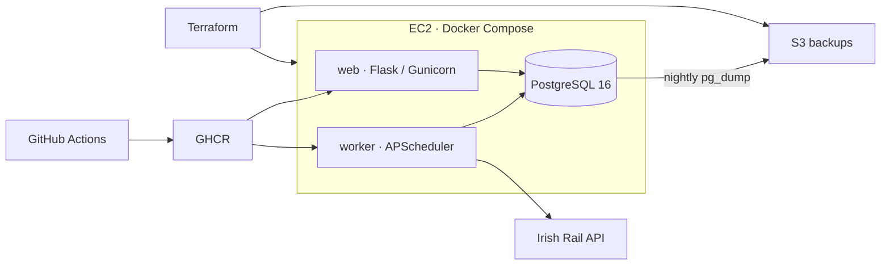

# Irish Rail Delay Tracker

[](https://github.com/DanSom0/irish-rail-tracker/actions/workflows/ci.yml)
[](https://github.com/DanSom0/irish-rail-tracker/actions/workflows/deploy.yml)

Tracks Irish Rail delays by polling station departure boards, storing the latest observation for each train at each station, and showing delays and averages by station and route. Built to demonstrate SRE/DevOps practice: automated checks and deployment, infrastructure as code, health checks, rollback, backups, and incident reviews.

**Live:** [http://54.228.205.197](http://54.228.205.197)

## Architecture



Web and worker share one Python 3.12 image. The worker polls every five minutes by default; PostgreSQL upserts on station, train code, and train date so repeated polls update the same observation.

## Local setup

Requires Git and Docker with the Compose plugin. From a terminal:

```sh
git clone https://github.com/DanSom0/irish-rail-tracker.git
cd irish-rail-tracker
cp .env.example .env
docker compose up --build
```

Open [localhost:8000](http://localhost:8000); [localhost:8000/health](http://localhost:8000/health) checks database connectivity. The worker calls the live API. Stop with Ctrl-C; the database remains in a named volume. Test and Terraform validation commands are in [AGENTS.md](AGENTS.md).

## CI/CD

1. **CI** runs on pull requests and pushes to `main`: Ruff, pytest against PostgreSQL 16, Terraform formatting and validation, and a Docker build. It also checks production Compose configuration and runs ShellCheck.
2. **Deploy** starts after successful CI for a push to this repository's `main`. It checks out the tested commit, builds the image, and pushes both its full commit SHA tag and `latest` to GHCR. A manual dispatch on `main` is also available.
3. The workflow copies production Compose and scripts to EC2, authenticates to GHCR, pulls the SHA-tagged image, starts the services, and installs the backup cron job. Production deploys run serially.
4. A public `/health` check must return HTTP 200 within the script's 60-second retry window. Failure fails the job; rollback is manual.

Deploy secrets live in the GitHub **production** environment: `EC2_HOST`, `EC2_USER`, `EC2_SSH_KEY`, and `EC2_KNOWN_HOSTS` (verified host-key entries). GHCR authentication uses the workflow's `GITHUB_TOKEN`; production application settings stay in the server's `.env`.

## Operations

### Provisioning (operator-run)

Terraform provisions an Ubuntu EC2 host and Elastic IP in `eu-west-1`, a private backup bucket, an instance role, and a billing alarm in `us-east-1`. Use Terraform **1.16.3** and local AWS credentials. Create the private S3 state bucket and an SSH key pair before initializing.

```sh
cp infra/backend.hcl.example infra/backend.hcl
cp infra/terraform.tfvars.example infra/terraform.tfvars
```

Edit the copies with the state bucket, public-key path, and billing email, then run:

```sh
terraform -chdir=infra init -backend-config=backend.hcl
terraform -chdir=infra plan -out=tfplan
terraform -chdir=infra apply tfplan
terraform -chdir=infra output
```

Review the plan before applying; **apply is always manual**. Use `instance_public_ip` for `EC2_HOST` and `backup_bucket_name` for `BACKUP_BUCKET`. Enable AWS billing alerts and confirm the billing alarm's subscription email. Never commit `.env`, `backend.hcl`, or `terraform.tfvars`.

Before the first deployment, create `/opt/irish-rail-tracker` on the host, owned by the deploy user (`ubuntu`). Copy `.env.production.example` there as `.env`, replace the placeholders, and set its mode to `600`. Docker and Compose are installed by Terraform user data. Configure the GitHub environment secrets and GHCR package access for the repository's workflow token.

### Rollback

On the host, redeploy a previous **full 40-character commit SHA** that was published to GHCR:

```sh
cd /opt/irish-rail-tracker
./scripts/rollback.sh '<previous-full-commit-sha>'
```

The script reuses the cached image or pulls it, starts the services, and runs the local health check. If the image is uncached and the package is private, authenticate to GHCR with read access first. This changes the application image, not database contents; a later successful deploy replaces the rollback.

### Backups

Deploy installs one cron entry for **03:00 in the server's timezone**. [`scripts/backup.sh`](scripts/backup.sh) compresses a plain SQL `pg_dump` and uploads it to `s3://<BACKUP_BUCKET>/backups/<UTC-timestamp>.sql.gz`. Logs go to `/opt/irish-rail-tracker/backup.log`. S3 has encryption, blocked public access, versioning, and a seven-day object expiry rule (noncurrent versions expire after one day).

The upload uses `amazon/aws-cli:2.36.49` and temporary instance-role credentials. After initial setup or changing the backup image, an operator should run `./scripts/backup.sh` on the host and confirm the object exists using separate S3 read access.

### Restore a backup (operator-run)

This replaces the current database and requires downtime. Using an operator identity with `s3:GetObject`, download the chosen object through the S3 console and securely copy it to the host as `/tmp/restore.sql.gz` with mode `600`. The instance role cannot read backups. Use a trusted dump from this application; run the following in Bash on the host.

```bash
set -euo pipefail
cd /opt/irish-rail-tracker
umask 077
gzip -t /tmp/restore.sql.gz
docker compose --env-file .env -f docker-compose.prod.yml stop web worker
before_restore=$(mktemp -d /tmp/irish-rail-before-restore.XXXXXX)
docker compose --env-file .env -f docker-compose.prod.yml exec -T db \
  sh -c 'pg_dump -U "$POSTGRES_USER" -d "$POSTGRES_DB"' \
  | gzip > "$before_restore/database.sql.gz"
echo "Current database saved to $before_restore/database.sql.gz"
docker compose --env-file .env -f docker-compose.prod.yml exec -T db \
  sh -c 'dropdb -U "$POSTGRES_USER" "$POSTGRES_DB" && createdb -U "$POSTGRES_USER" -O "$POSTGRES_USER" "$POSTGRES_DB"'
gzip -dc /tmp/restore.sql.gz \
  | docker compose --env-file .env -f docker-compose.prod.yml exec -T db \
    sh -c 'psql -X -v ON_ERROR_STOP=1 --single-transaction -U "$POSTGRES_USER" -d "$POSTGRES_DB"'
docker compose --env-file .env -f docker-compose.prod.yml exec -T db \
  sh -c 'psql -X -U "$POSTGRES_USER" -d "$POSTGRES_DB" -c "SELECT count(*), max(fetched_at) FROM observations;"'
```

If a step fails, leave web and worker stopped and investigate; the pre-restore dump preserves the previous data. Check the restored row count and last observation time before restarting the existing containers (which preserves their image version):

```sh
docker compose --env-file .env -f docker-compose.prod.yml start web worker
./scripts/healthcheck.sh http://localhost/health
```

Check the dashboard and worker logs, then remove the temporary dump files once recovery is confirmed.

### Monitoring

Configure an external uptime monitor for [the public `/health` endpoint](http://54.228.205.197/health), expecting HTTP 200. It checks the web process and database connection, not worker freshness. Inspect worker JSON logs for per-station `entries_parsed` and cycle `observations_saved`, and review `backup.log` for upload failures.

## Environment variables

Production values come from [`.env.production.example`](.env.production.example). Keep entries shell-compatible because the backup script sources the file.

| Variable | Example/default | Purpose |
| --- | --- | --- |
| `POSTGRES_DB` | Required | Database name; letters, digits, and underscores. |
| `POSTGRES_USER` | Required | Database user; letters, digits, and underscores. |
| `POSTGRES_PASSWORD` | Required | Random hex password; generate with `openssl rand -hex 32`. |
| `STATION_CODES` | `CNLLY,PERSE,HSTON,TARA,MHIDE` | Comma-separated stations to poll. |
| `FETCH_INTERVAL_MINUTES` | `5` | Worker polling interval in minutes. |
| `REQUEST_TIMEOUT_SECONDS` | `15` | Timeout for each API request in seconds. |
| `IRISH_RAIL_API_URL` | Unset | Optional override; defaults to `http://api.irishrail.ie/realtime/realtime.asmx/getStationDataByCodeXML`. |
| `BACKUP_BUCKET` | Required | Terraform's backup bucket name. |
| `AWS_REGION` | Required (`eu-west-1` here) | Backup bucket region. |
| `IMAGE_TAG` | `latest` | Deploy and rollback override this with a full commit SHA. |

Compose builds `DATABASE_URL` from the PostgreSQL settings. `WEB_PORT` is local-only (default `8000`); production publishes port `80`.

## Design decisions

- **Compose on one host:** web, worker, and database fit a small deployment. Kubernetes would add cluster management without a current need for multiple hosts.
- **Manual Terraform apply:** an operator reviews infrastructure changes and costs. CI only checks formatting and validates configuration.
- **SSH access:** port 22 is open with key-only authentication because GitHub-hosted runner IPs are not fixed. AWS SSM is a future improvement.
- **Least-privilege instance role:** only `s3:PutObject` on the backup bucket's `backups/` prefix; no stored AWS keys on the server. Restore uses separate operator read access.
- **SHA-tagged images:** deploy and rollback select an exact commit, so the running version is known even when `latest` changes.
- **Delay meaning:** `Late` is the latest polled delay in minutes. Once a train leaves the board, its stored value is the last reading before it disappeared, not a confirmed final arrival delay.

## Postmortems

- [Successful fetches but zero observations](docs/postmortems/2026-09-zero-observations.md)
- [Backup image tag did not exist](docs/postmortems/2026-09-backup-image-tag.md)
