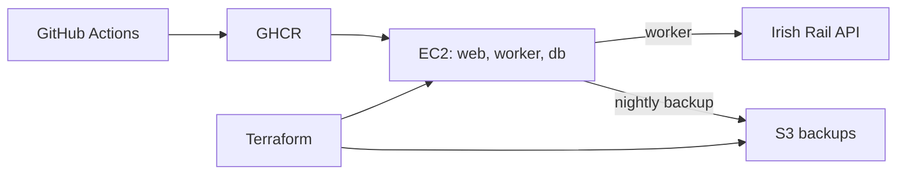

# Irish Rail Delay Tracker

[](https://github.com/DanSom0/irish-rail-tracker/actions/workflows/ci.yml) [](https://github.com/DanSom0/irish-rail-tracker/actions/workflows/deploy.yml)

Tracks Irish Rail delays and shows averages by station and route. Built to demonstrate SRE/DevOps practice: testing, deployment, and running a service.

**[Live app](http://54.228.205.197)** · **[Operations and settings](docs/operations.md)**



## What this demonstrates

- Automated tests and checks before deployment.
- Server setup managed through Terraform.
- Known app versions and manual rollback.
- Nightly backups and a restore procedure.
- Incident reviews based on real faults.

## Local setup

Requires Git and Docker with Compose:

```sh
git clone https://github.com/DanSom0/irish-rail-tracker.git
cd irish-rail-tracker
cp .env.example .env
docker compose up --build
```

Open [localhost:8000](http://localhost:8000). The worker calls the live API. See [AGENTS.md](AGENTS.md) for tests and local checks.

## CI/CD

1. Run Ruff, pytest against Postgres, Terraform checks, and a Docker build.
2. After checks pass on `main`, publish the tested commit's image to GitHub's image registry (GHCR), tagged with its commit ID (SHA).
3. EC2 downloads that image and starts the services with Compose.
4. Check `/health` for HTTP 200 for up to 60 seconds. Failure fails the deploy job; rollback is manual.

## Design decisions

- **Compose:** one host keeps setup simple. Kubernetes adds work this app does not need.
- **Terraform:** a person reviews and applies changes. CI only checks the configuration.
- **SSH:** port 22 is open with key-only login because GitHub runner IPs are not fixed. AWS SSM is a future improvement.
- **AWS access:** the server's AWS role only allows writes (`PutObject`) to `backups/` in its backup bucket. No AWS keys are stored on the server.
- **Image tags:** each deployed image uses its commit SHA, so the running version is known.
- **Delay:** the last reading before a train leaves the board, not a confirmed final arrival delay.

## Postmortems

[Zero observations](docs/postmortems/2026-09-zero-observations.md) · [Missing backup image tag](docs/postmortems/2026-09-backup-image-tag.md)
