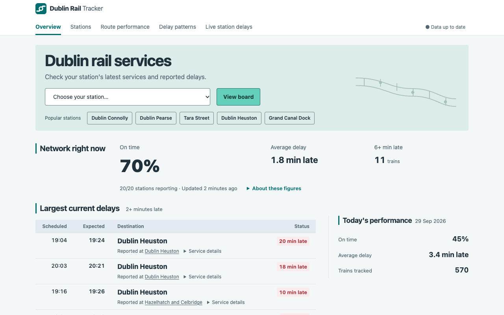
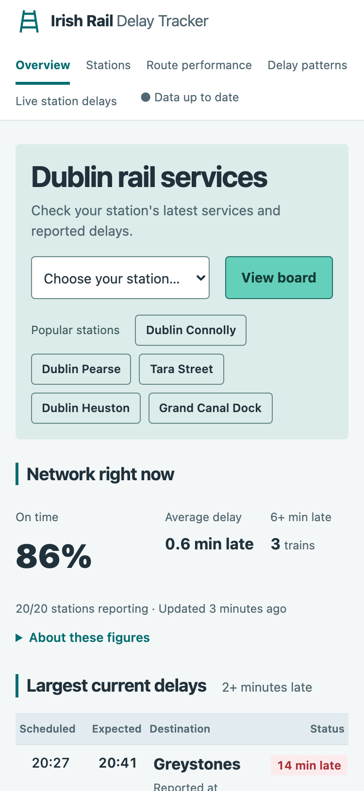
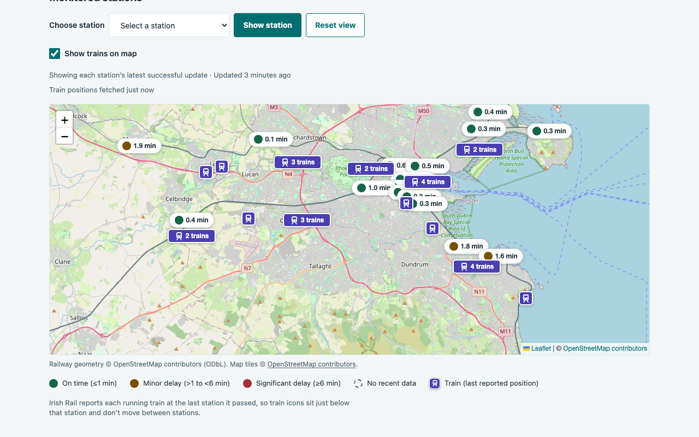
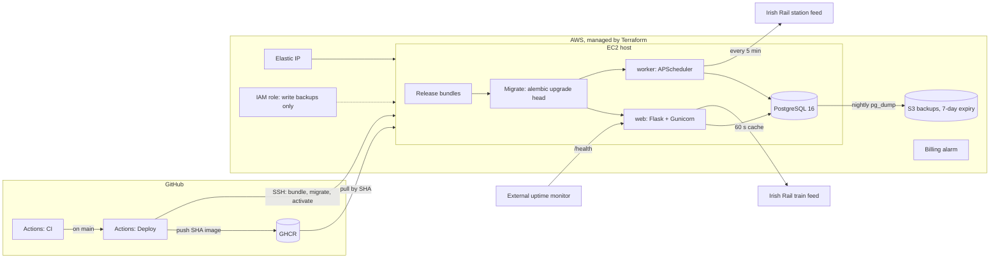

# Irish Rail Delay Tracker

[](https://github.com/DanSom0/irish-rail-tracker/actions/workflows/ci.yml) [](https://github.com/DanSom0/irish-rail-tracker/actions/workflows/deploy.yml)

A live dashboard of train delays at 20 Dublin-area stations, built from Irish Rail's public realtime feed. It is a small service run like a production one. Terraform builds the infrastructure, CI tests every change, and deploys are SHA-pinned, migrated and health-gated. It has nightly backups, health and ingestion checks, and written postmortems for real incidents.

**[Live app: http://54.228.205.197](http://54.228.205.197)** · [Operations runbook](docs/operations.md)

<p>
  
  
</p>


## Features

- **Station finder:** pick a station, or use a shortcut to a busy one.
- **Network right now:** on-time share, average delay and trains 6+ minutes late across monitored stations.
- **Current delays:** scheduled and expected times, including across midnight and clock changes.
- **Station boards:** next services and largest delays, with arrivals, departures and calling services labelled.
- **Route performance:** average delay by origin and destination, today or yesterday.
- **Delay patterns:** a heatmap of average delay by weekday and scheduled hour.
- **Live map:** station delay markers and each train's last reported position.
- **Data status:** each station's latest poll ("OK, N trains", "No services returned", "Update failed; showing data from HH:MM"), disk use, `/health` and `/health/ingestion`.

## Architecture


```mermaid
flowchart LR
  subgraph GH[GitHub]
    CI[Actions: CI] -->|on main| DEP[Actions: Deploy]
    DEP -->|push SHA image| GHCR[(GHCR)]
  end
  subgraph AWS[AWS, managed by Terraform]
    EIP[Elastic IP] --> EC2
    subgraph EC2[EC2 host]
      REL[Release bundles] --> MIG[Migrate: alembic upgrade head]
      MIG --> WEB[web: Flask + Gunicorn]
      MIG --> WRK[worker: APScheduler]
      WEB --> DB[(PostgreSQL 16)]
      WRK --> DB
    end
    IAM[IAM role: write backups only] -.-> EC2
    S3[(S3 backups, 7-day expiry)]
    BILL[Billing alarm]
  end
  DEP -->|SSH: bundle, migrate, activate| EC2
  GHCR -->|pull by SHA| EC2
  WRK -->|every 5 min| STN[Irish Rail station feed]
  WEB -->|60 s cache| TRN[Irish Rail train feed]
  DB -->|nightly pg_dump| S3
  MON[External uptime monitor] -->|/health| WEB
```

## How it's built and operated

- **CI:** every pull request and push runs Ruff, pytest against PostgreSQL 16, Terraform format and validate, ShellCheck, a production Compose config check and a Docker build.
- **Deploy:** after CI passes on `main`, Deploy builds an image tagged with the commit SHA. It copies that commit's Compose file and scripts to the server as a release bundle.
  - **Migrations first:** it migrates the database before starting anything new.
  - **Health-gated activation:** the new release only becomes current after `/health` passes on the server.
  - **Release check:** the job then checks that the public `/health` reports the deployed SHA.
- **Rollback:** it switches the image and the release bundle together, and never downgrades the database.
- **Migrations:** Alembic owns the schema. Each migration must keep working with the previous release, because rollback does not run migrations.
- **Backups:** a nightly `pg_dump` goes to a private, encrypted S3 bucket.
  - **Restore check:** on 28 Sep 2026 a backup was restored into a scratch database, and its row counts matched production. This was a manual check; automated restore checks are [#45](https://github.com/DanSom0/irish-rail-tracker/issues/45).
- **Disk:** container logs are capped, only the current and two previous release images are kept, and `/status` shows disk use.
- **Health:** `/health` is liveness (web and database, plus the running release). `/health/ingestion` is readiness: it returns HTTP 503 if the worker has not finished a fetch cycle recently, and counts stations by poll outcome.

## Design decisions

- **Compose on one host:** simple to run and reason about. Kubernetes would add work this app does not need.
- **Manual `terraform apply`:** a person reviews and applies changes. CI only formats and validates.
- **SSH open with key-only login:** GitHub runner IPs are not fixed. AWS SSM is a possible later step.
- **Least-privilege instance role:** the server can only write to `backups/` in its bucket. No AWS keys are stored on it.
- **SHA-pinned deploys:** a manual restart with `latest` once reverted production ([postmortem](docs/postmortems/2026-09-stale-latest-image.md)), so the server records the exact SHA it runs.
- **Station list in code:** the 20 stations are defined in the app. A fallback list in Compose had drifted from it ([#25](https://github.com/DanSom0/irish-rail-tracker/pull/25)).
- **"Current" means the latest successful poll:** each station's current trains are exactly those from its latest successful poll. An empty board clears it, and a failed poll keeps the old board, marked as not current.
- **Train positions are last-reported stations, not GPS:** Irish Rail reports a running train at the last station it passed.
- **Train feed fetched server-side:** the web app fetches it with a short timeout and caches each result for 60 seconds, including failures, so a slow feed cannot tie up the site. After a failure it shows the last good positions as stale.
- **One Dublin time conversion:** the same code converts times for display and filtering, including across clock changes.
- **Early trains:** the map and the delay-patterns heatmap count an early train as 0 minutes late. The overview and station averages still subtract early minutes. Using one definition everywhere is [#49](https://github.com/DanSom0/irish-rail-tracker/issues/49).
- **What "delay" means:** the last reported delay before a train leaves the board, not a confirmed arrival delay.

## Incidents

Blameless postmortems, based on the git history and pull requests:

- [Successful fetches but zero observations](docs/postmortems/2026-09-zero-observations.md): the parser missed the feed's XML namespace, so nothing was stored.
- [Backup image tag did not exist](docs/postmortems/2026-09-backup-image-tag.md): a manual backup run found an unpublished AWS CLI tag before the first scheduled backup.
- [EC2 instance replacement](docs/postmortems/2026-09-instance-replacement.md): a failed merge let a root-volume change be applied from `main` without its fix, and Terraform replaced the server.
- [A manual restart with "latest" reverted production](docs/postmortems/2026-09-stale-latest-image.md): the server's `latest` tag pointed at an older image.
- [Departed trains shown as current delays](docs/postmortems/2026-09-stale-current-delays.md): empty and failed polls were not stored, so old trains stayed on the boards.
- [Deploys reported success without activating](docs/postmortems/2026-09-deploys-without-activation.md): Compose read the rest of the deploy script, which then ended early with success.

## Roadmap

Planned work is tracked in [open issues](https://github.com/DanSom0/irish-rail-tracker/issues).

## Run locally

Requires Git and Docker with Compose:

```sh
git clone https://github.com/DanSom0/irish-rail-tracker.git
cd irish-rail-tracker
cp .env.example .env
docker compose up --build
```

Open [localhost:8000](http://localhost:8000). The worker polls the live Irish Rail feed. Tests and checks are in [AGENTS.md](AGENTS.md). Provisioning, deploys, rollback, backups and monitoring are in [docs/operations.md](docs/operations.md).

## Licence

[MIT](LICENSE) © Daniel English
